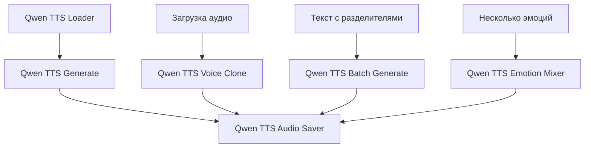

<div align="center">

# 🎤 Qwen-TTS Nodes for ComfyUI


  
  **Ноды для интеграции Qwen3-TTS в ComfyUI с поддержкой эмоций и клонирования голоса**

  [](https://www.python.org/)
  [](https://pytorch.org/)
  [](https://huggingface.co/Qwen)

</div>

---

## 📋 Оглавление

- [✨ Особенности](#-особенности)
- [🚀 Установка](#-установка)
- [🎯 Ноды](#-ноды)
- [🎨 Пример Workflow](#-пример-workflow)
- [🔧 Параметры моделей](#-параметры-моделей)
- [📁 Структура проекта](#-структура-проекта)
- [❓ Частые вопросы](#-частые-вопросы)
- [📄 Лицензия](#-лицензия)

---

## ✨ Особенности

<div align="center">
  
</div>

- 🎭 **Поддержка эмоций** - синтез речи с различными эмоциональными окрасками
- 🎤 **Клонирование голоса** - создание голосовых двойков из эталонных аудио
- 🌍 **Многоязычность** - поддержка русского, английского и других языков
- ⚡ **Высокая производительность** - оптимизация для CUDA и CPU
- 🎨 **Гибкая настройка** - тонкая регулировка параметров синтеза
- 🔄 **Пакетная обработка** - массовая генерация аудиофайлов

---

## 🚀 Установка

### Метод 1: Через ComfyUI Manager (рекомендуется)

1. Откройте **ComfyUI Manager**
2. Перейдите в **Custom Nodes Install** → **Install via Git URL**
3. Введите URL: `https://github.com/SLVGITHUB/QWEN3_TTS_DVA`
4. Нажмите **Install**
5. Перезапустите ComfyUI

### Метод 2: Ручная установка

```bash
# Клонируйте репозиторий в каталог custom_nodes
cd ComfyUI/custom_nodes
git clone https://github.com/SLVGITHUB/QWEN3_TTS_DVA.git

# Установите зависимости
pip install -r requirements.txt
# Или установите вручную
pip install qwen-tts soundfile openai-whisper faster_whisper
```

### Требования

- Python 3.8+
- ComfyUI последней версии
- PyTorch 2.0+
- Видеокарта с поддержкой CUDA (рекомендуется) или CPU

---

## 🎯 Ноды

### 📦 Qwen TTS Loader
**Загружает модель синтеза речи Qwen-TTS в память**

<div align="center">
  
</div>

**Поддерживаемые модели:**
- `Qwen3-TTS-Base` - для клонирования голоса
- `Qwen3-TTS-CustomVoice` - синтез по имени спикера
- `Qwen3-TTS-VoiceDesign` - синтез по текстовому описанию

**Параметры:**
- **Точность вычислений**: fp16, bf16, fp32
- **Устройство**: CUDA, CPU
- **Тип внимания**: стандартный, оптимизированный

---

### 🎤 Qwen TTS Generate
**Генерирует речь из текста без референсного аудио**

<div align="center">
  
</div>

**Особенности:**
- Поддержка языков: русский, английский, китайский, японский и другие
- Эмоциональные пресеты: нейтральный, радостный, грустный, злой, испуганный
- Расширенные параметры: температура, top-p, длина сэмпла
- Для CustomVoice: указание имени спикера (например, "Vivian", "Alex", "Maya")

---

### 🎭 Qwen TTS Voice Clone
**Клонирует голос из референсного аудиофайла**

<div align="center">
  
</div>

**Требования:**
- Входное аудио (референс) - WAV, MP3, FLAC
- Текст, произнесённый в аудио (ref_text)
- Новый текст для синтеза

**Идеально для:**
- Создания голосовых двойков
- Озвучки контента уникальным голосом
- Воссоздания исторических речей

---

### 📚 Qwen TTS Batch Generate
**Генерирует несколько аудиофайлов за один запуск**

<div align="center">
  
</div>

**Функционал:**
- Разделение текста по указанному разделителю (по умолчанию "|")
- Параллельная или последовательная обработка
- Автоматическая нумерация файлов
- Поддержка разных параметров для каждого сегмента

---

### 💾 Qwen TTS Audio Saver
**Сохраняет сгенерированное аудио на диск**

<div align="center">
  
</div>

**Параметры сохранения:**
- Формат: WAV (16-bit, 24kHz)
- Папка назначения: `ComfyUI/output/tts/`
- Автоматическое удаление файла
- Метаданные в JSON формате
- Перезапись или инкрементальное сохранение

---

### 🔀 Qwen TTS Emotion Mixer
**Смешивает варианты с разными эмоциями**

<div align="center">
  
</div>

**Применение:**
- Создание сложных эмоциональных переходов
- Смешивание 70% "спокойного" + 30% "энергичного"
- Корректировка весов в реальном времени
- Нормализация суммы весов до 1.0

---

## 🎨 Пример Workflow


<div align="center">
  
</div>


**Типичный сценарий использования:**
1. Загрузите модель через **Qwen TTS Loader**
2. Сгенерируйте речь через **Qwen TTS Generate**
3. Настройте параметры сохранения в **Qwen TTS Audio Saver**
4. Запустите workflow

---

## 🔧 Параметры моделей

### Рекомендуемые настройки

| Параметр | Qwen3-TTS-Base | Qwen3-TTS-CustomVoice | Qwen3-TTS-VoiceDesign |
|----------|----------------|------------------------|------------------------|
| Температура | 0.6-0.8 | 0.7-0.9 | 0.7-0.9 |
| Top-P | 0.8-0.95 | 0.85-0.98 | 0.85-0.98 |
| Длина сэмпла | 2048 | 1024 | 1024 |

### Поддерживаемые языки

- 🇷🇺 Русский (ru)
- 🇺🇸 Английский (en)
- 🇨🇳 Китайский (zh)
- 🇯🇵 Японский (ja)
- 🇰🇷 Корейский (ko)
- 🇫🇷 Французский (fr)
- 🇩🇪 Немецкий (de)
- 🇪🇸 Испанский (es)

---

## 📁 Структура проекта

```
QWEN3_TTS_DVA/
├── qwen_tts_comfy/
│   ├── nodes.py              # Основные ноды ComfyUI
│   ├── __init__.py
│   ├── requirements.txt      # Зависимости Python
│   └── README.md
├── examples/
│   ├── workflows/
│   └── audio_samples/
├── images/                   # Изображения для документации
└── LICENSE
```

---

## ❓ Частые вопросы

### ❓ Какую модель выбрать?
- Для клонирования голоса: **Qwen3-TTS-Base**
- Для готовых голосов: **Qwen3-TTS-CustomVoice**
- Для создания уникальных голосов: **Qwen3-TTS-VoiceDesign**

### ❓ Почему медленно работает на CPU?
Модели TTS требуют значительных вычислительных ресурсов. Рекомендуется использовать GPU с поддержкой CUDA.

### ❓ Как улучшить качество синтеза?
- Используйте более длинные референсные аудио для клонирования
- Экспериментируйте с параметрами температуры и top-p
- Используйте эмоциональные пресеты для выразительности

### ❓ Поддерживаются ли другие форматы аудио?
Входные аудио: WAV, MP3, FLAC, OGG
Выходные аудио: WAV (стандарт), возможно конвертирование через дополнительные ноды

---

## 📄 Лицензия

Этот проект распространяется под лицензией MIT. Подробности см. в файле [LICENSE](LICENSE).

---

## 🔗 Полезные ссылки

<div align="center">

[🌐 Официальный репозиторий Qwen3-TTS](https://github.com/QwenLM/Qwen3-TTS) |
[🤗 Модели на Hugging Face](https://huggingface.co/collections/Qwen/qwen3-tts) |
[💬 Обсуждение проблем](https://github.com/SLVGITHUB/QWEN3_TTS_DVA/issues)

</div>

---

## 🤝 Вклад в проект

Приветствуются:
- Сообщения об ошибках
- Предложения по улучшению
- Pull requests
- Примеры workflows

---

<div align="center">

**Создано с ❤️ для сообщества ComfyUI**

⭐ Если вам нравится этот проект, поставьте звезду на GitHub!

</div>


